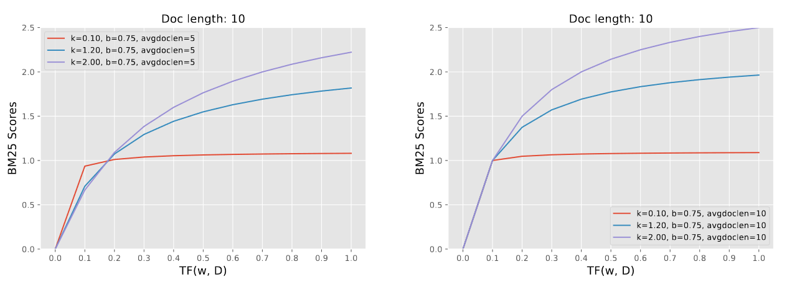
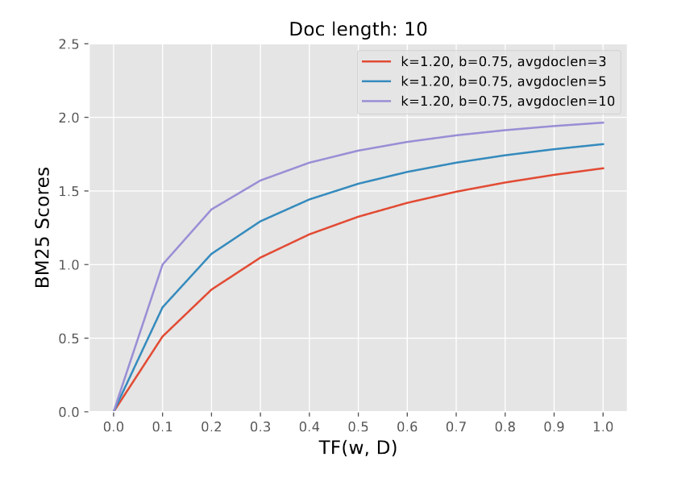
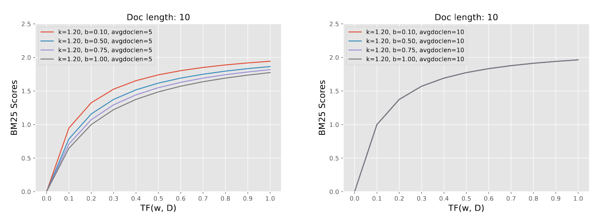

# JUDUL SKIRPSI

Carles Octavianus (2006568613)
Last Update: 2023-11-22

---

# Landasan Teori

---

## Pemeringkatan Teks

Permasalahan pemeringkatan teks adalah Permasalahan untuk menentukan urutan dokumen yang paling relevan dengan kueri $q$ yang diberikan. Dalam bahasa yang lebih formal, diberikan kueri $q$ dan himpunan dokumen terbatas $\mathcal{D}= \{d_1, d_2, ..., d_n\}$, keluaran yang diinginkan dari permasalahan ini adalah barisan dokumen $D_k = (d_{i_1}, d_{i_2}, ..., d_{i_k})$ yang merupakan $k$ dokumen yang paling relevan dengan kueri $q$

Untuk mengukur performa suatu model pemeringkatan, biasanya digunakan metrik evaluasi seperti presisi, *recall*, *reciprocal rank*, dan *normalized discounted cumulative gain* (nDCG).

---
## Bentuk Umum Dataset untuk Evaluasi
umumnya *dataset* evaluasi untuk masalah pemeringkatan teks terdiri dari 3 *file* berikut:
-  kumpulan teks dalam bentuk (teks_id, teks) yang biasa disebut dengan *file* **corpus**.
-  kumpulan query dalam bentuk (query_id, query) yang biasa disebut dengan *file* **queries**.
-  kumpulan *judgements* yang telah dianotasi dalam bentuk (query_id, teks_id, nilai relevansi) atau dalam penulisan singkatnya$(q,d,r)$. *file* yang memuat *judgements* biasa disebut dengan *file* **qrels**.

---

| _id        | title               | text                                                                                          |
|------------|---------------------|-----------------------------------------------------------------------------------------------|
| 1342516#1  | Colobothea biguttata | Larva kumbang ini biasanya mengebor ke dalam kayu dan dapat menyebabkan kerusakan pada batang kayu hidup atau kayu yang telah ditebang. |
| 1342517#0  | Ichthyodes rufipes  | Ichthyodes rufipes adalah spesies kumbang tanduk panjang yang berasal dari famili Cerambycidae. Spesies ini juga merupakan bagian dari genus Ichthyodes, ordo Coleoptera, kelas Insecta, filum Arthropoda, dan kingdom Animalia. |

Sebagian isi dari *file* **corpus** pada *dataset* MIRACL

---

| _id | text                                      |
|-----|-------------------------------------------|
| 3   | Dimana James Hepburn meninggal?            |
| 4   | Dimana Jamie Richard Vardy lahir?          |
| 11  | berapakah luas pulau Flores?               |
| 17  | Siapakah yang menulis Candy Candy?         |
| 19  | Apakah karya tulis Irma Hardisurya yang pertama? |

Sebagian isi dari *file* **queries** pada *dataset* MIRACL

---

| query-id | corpus-id  | score |
|----------|------------|-------|
| 3        | 115796#6   | 1     |
| 3        | 77689#48   | 1     |
| 4        | 1852373#0  | 1     |

Sebagian isi dari *file* **qrels** pada *dataset* MIRACL.

Biasanya pasangan $(q, d)$ yang tidak ada dalam **qrels**, diasumsikan memiliki nilai relevansi 0.

---

## Metrik Evaluasi

1. ***Recall* dan Presisi**
   - *Recall*: Dari semua dokumen yang relevan, berapa banyak yang berhasil ditemukan dalam daftar terurut $D_k$.
   - *Presisi*: Dari semua dokumen yang berhasil ditemukan dalam daftar terurut $D_k$, berapa banyak yang relevan.

$$
\begin{align}
    \label{eq:recall}
    \mathcal{D} &= \{d_1, d_2, \dots, d_n\} \\
    D_k &= (d_{i_1}, d_{i_2}, \dots, d_{i_k}) \\
    \text{recall}(q, D_k)\text{@k} &= \frac{\sum_{d \in D_k} \text{rel}(q, d)}{\sum_{d \in \mathcal{D}} \text{rel}(q, d)} \in [0, 1] \\
    \label{eq:presisi}
    \text{precision}(q, D_k)\text{@k} &= \frac{\sum_{d \in D_k} \text{rel}(q, d)}{|D_k|} \in [0, 1] \\
    \label{eq:rel}
    \text{dengan } \text{rel}(q, d) &= \begin{cases} 
    1 & \text{jika } r > 1 \\
    0 & \text{jika } r = 0
    \end{cases}        
\end{align}
$$

---

---
1. *Recriprocal Rank* (RR)
Metrik RR menitikberatkan pada peringkat pertama dari dokumen dalam $D_k$ yang relevan dengan kueri $q$.

$$
\begin{align}
\text{RR}(q, D_k)\text{@k} &= \begin{cases}
    \label{eq:reciprocal-rank-start}
    \frac{1}{\text{FirstRank}(q, D_k)} & \text{jika } \exists d \in D_k \text{ dengan } \text{rel}(q, d) = 1 \\        
    0 & \text{jika } \forall d \in D_k, \text{ rel}(q, d) = 0 \\
    \end{cases} \in [0, 1] \\
    \label{eq:reciprocal-rank-end}
    \text{FirstRank}(q,D_k) &= \text{posisi dokumen relevan pertama } d\in D_k \text{ dengan } \text{rel}(q, d) = 1
\end{align}

$$

---

---

3. *Normalized Discounted Cumulative Gain* (nDCG) adalah metrik yang umumnya digunakan untuk mengukur kualitas dari pencarian situs web. Tidak seperti metrik yang telah disebutkan sebelumnya, nDCG dirancang untuk suatu *judgements* $r$ yang tak biner.

---

$$
        \begin{align}
            \label{eq:ndcg-start}
            \text{nDCG}(q, D_k)\text{@k} &= \frac{\text{DCG}(q, D_k)\text{@k}}{\text{DCG}(q, D_k^{\text{ideal}})\text{@k}} \in [0, 1] \\
            \label{eq:dcg}
            \text{DCG}(q, D_k)\text{@k} &= \sum_{d \in D_k} \frac{2^{\text{rel}(q, d)} - 1}{\log_2(\text{rank}(d, D_k) + 1)} \\
            \label{eq:ndcg-end}
            \text{rank}(d,D_k) &= \text{Posisi } d \text{ dalam } D_k \\
            \text{rel}(q, d) &= r
        \end{align}
$$

---

- faktor $2^{\text{rel}(q, d)} - 1$ menunjukkan bahwa dokumen yang lebih relevan akan memiliki nilai yang lebih tinggi dari dokumen yang kurang relevan.
  
- faktor $\frac{1}{\log_2(\text{rank}(d, D_k) + 1)}$ menunjukkan bahwa dokumen yang relevan yang muncul pada peringkat yang lebih tinggi akan memiliki nilai yang lebih tinggi dari dokumen dengan relevansi yang sama, tetapi muncul pada peringkat yang lebih rendah.

---

---

## Pemeringkatan Teks Dengan Statistik

Untuk mengambil $k$ dokumen dari kumpulan $\mathcal{D}$ diperlukan suatu fungsi skor $\text{score}(q, d, \mathcal{D})$ yang mengukur relevansi antara kueri $q$ dan dokumen $d$. dengan mencari skor antar $q$ terhadap semua dokumen pada $\mathcal{D}$, Barisan dokumen $D_k = (d_{i_1}, d_{i_2},\dots, d_{i_k})$ dapat dipilih sehingga $\text{score}(q, d_{i_1}) \geq \text{score}(q, d_{i_2}) \geq \dots \geq \text{score}(q, d_{i_k})$ adalah $k$ dokumen dengan skor tertinggi.

---

**TF-IDF**

fungsi skor TF-IDF adalah fungsi skor statistik yang mengukur relevansi antara kueri $q$ dan dokumen $d$ dengan menghitung frekuensi kemunculan kata pada dokumen dan kueri. Untuk suatu kueri $q$, misalkan $T_q= \{t_1, t_2, \dots, t_{L_1}\}$ adalah himpunan kata yang terdapat pada kueri $q$. Selain itu, misalkan $T_d = \{t_1, t_2, \dots, t_{L_2}\}$ adalah himpunan kata yang terdapat pada dokumen $d$, fungsi skor TF-IDF didefinisikan sebagai berikut:

---

$$
\begin{align}
    \label{eq:tfidf-start}
    \mathcal{D} &= \{d_1, d_2, \dots, d_n\} \\
    T_q &= \{t_1, t_2, \dots, t_{L_1}\} \\
    T_d &= \{t_1, t_2, \dots, t_{L_2}\} \\
    \text{tf}(t, d) &= \frac{\text{Count}(t, d)}{|d|} \\
    \text{Count}(t, d) &= \text{jumlah kemunculan } t \text{ dalam } d \\
    \text{df}(t, \mathcal{D}) &= \text{jumlah dokumen pada } \mathcal{D} \text{ yang mengandung } t \\
    \text{idf}(t, \mathcal{D}) &= \begin{cases}
        \log_2\left(\frac{|\mathcal{D}|}{\text{df}(t, \mathcal{D})}\right) & \text{jika } \text{df}(t, \mathcal{D}) > 0 \\
        0 & \text{jika } \text{df}(t, \mathcal{D}) = 0
    \end{cases} \\
    \label{eq:tf-idf-weight}
    \text{tf-idf}(t, d, \mathcal{D}) &= \text{tf}(t, d) \times \text{idf}(t, \mathcal{D}) \\
    \label{eq:tfidf-end}
    \text{score}(q,d,\mathcal{D}) &= \sum_{t \in T_q \cap T_d} \text{tf-idf}(t, d, \mathcal{D})
\end{align}
$$

---
- faktor $\text{tf}(t, d)$ menunjukkan bahwa nilai TF-IDF meningkat seiring dengan bertambahnya frekuensi kemunculan kata $t$ pada dokumen $d$.
  
- Faktor $\text{idf}(t, \mathcal{D})$ menunjukkan bahwa nilai TF-IDF meningkat seiring dengan *rarity* dari kata $t$ pada himpunan dokumen $\mathcal{D}$. Akibatnya, kata yang jarang muncul pada himpunan dokumen $\mathcal{D}$ dan muncul pada suatu dokumen tertentu akan menghasilkan skor yang tinggi. Sementara itu, kata-kata yang sering muncul pada koleksi dokumen $\mathcal{D}$ memiliki nilai *downgraded*.

---

Contoh perhitungan skor TF-IDF

---

---

**BM25** (*Best Match Attempt 25*)
- improvement dari TF-IDF untuk mengatasi masalah dokumen yang panjang. Pada TF-IDF dokumen yang panjang akan selalu mendapatkan skor yang lebih tinggi daripada dokumen yang pendek. Tapi, tidak semua dokumen yang panjang lebih relevan daripada dokumen yang pendek.

$$
    \begin{align}
        \label{eq:smoothed-idf}
        \text{idf}_{\text{BM25}}(t, \mathcal{D}) &= \log\left(1+\frac{|\mathcal{D}| - \text{df}(t, \mathcal{D}) + 0.5}{\text{df}(t, \mathcal{D}) + 0.5}\right) \\
        \label{eq:bm25scoring}
        \text{score}_{\text{BM25}}(t,d) &= \frac{\text{tf}(t, d) \times (k_1 + 1)}{\text{tf}(t, d) + k_1 \times (1 - b + b \times \frac{|d|}{\text{avgdl}})} \\
        \label{eq:bm25-weight}
        \text{BM25}(t, d, \mathcal{D}) &= \text{idf}_{\text{BM25}}(t, \mathcal{D}) \times \text{score}_{\text{BM25}}(q,d,\mathcal{D}) \\
        \text{avgdl} &= \text{rata-rata panjang dokumen pada koleksi } \mathcal{D} \\
        \label{eq:bm25-end}
        \text{score}(q,d,\mathcal{D}) &= \sum_{t \in T_q \cap T_d} \text{BM25}(t, d, \mathcal{D}) \\
    \end{align}

$$

---
**Perbedaan IDF pada TF-IDF dan BM25**

$$
\text{idf}_{\text{BM25}}(t, \mathcal{D}) = \log\left(1+\frac{|\mathcal{D}| - \text{df}(t, \mathcal{D}) + s}{\text{df}(t, \mathcal{D}) + s}\right)
$$

---
**Efek dari parameter k**

biasanya kita pilih $k_1 \in [1.2, 2.0]$

---
**Efek dari avgdl**

---
**Efek dari parameter b**

biasanya kita pilih $b \in [0.5, 0.8]$

---

## Deep Learning

---

Arsitektur *Deep learning* merujuk pada model *machine learning* yang tersusun dari fungsi-fungsi terturunkan (biasanya setiap fungsi disebut sebagai *layer* atau *hidden layer*), dimana komposisi antar fungsi-fungsi tersebut dapat digambarkan sebagai *directed acyclic graph* (DAG) yang memetakan suatu *input* ke suatu *output*. Pada umumnya, setiap *layer* tersebut dalam Arsitektur *Deep learning* memiliki parameter yang ingin diestimasi atau dicari dengan data.

---

Ilustrasi Arsitektur Deep Learning

---

***Feedforward Neural Network* (FNN)**

*adalah salah satu arsitektur* *deep learning* *yang paling sederhana. Pada* *feed-forward neural network*, setiap fungsi $f_i$ adalah fungsi linear yang diikuti oleh fungsi aktivasi non-linear $\phi$  yang diterapkan *element-wise* pada setiap *output*-nya. *hyperparameter* lainnya selain fungsi aktivasi adalah kedalamaan model $L$, dan dimensi *output* dari setiap *layer* $d_1, d_2, \dots, d_L$.

---
Untuk permasalahan regresi dengan *input* $\mathbf{x}\in \mathbb{R}^{d_0}$ dan *output* $\mathbf{y} \in \mathbb{R}^{d_L}$, model *feed-forward neural network* dapat dituliskan sebagai berikut:

$$
\begin{align}
f_l(\mathbf{x};\mathbf{W}_l, b_l) &= \phi( \mathbf{x} \mathbf{W}_l + \mathbf{b}_l) \in \mathbb{R}^{d_l}, \quad l = 1, 2, \dots, L-1 \\
f_L(\mathbf{x}) &= \mathbf{x} \mathbf{W}_L + \mathbf{b}_L \in \mathbb{R}^{d_L} \\
f_{\text{model}}(\mathbf{x};\theta) &= f_L(f_{L-1}(\dots f_1(\mathbf{x})) \dots) \\
\phi(\mathbf{x}) &= \text{fungsi aktivitasi non-linear} \\
{\theta} &= \{\mathbf{W}_1, \mathbf{b}_1, \mathbf{W}_2, \mathbf{b}_2, \dots, \mathbf{W}_L, \mathbf{b}_L\} \\
\mathbf{W}_l &= \text{matriks bobot}  \in \mathbb{R}^{d_{l-1} \times d_l} \\
\mathbf{b}_l &= \text{vektor bias} \in \mathbb{R}^{d_l}
\end{align}
$$

---

Untuk Permasalahan Klasifikasi Biner dengan *input* $\mathbf{x}\in \mathbb{R}^{d_0}$ dan *output* $\mathbf{y} \in \{0, 1\}$, Persamaan di bawah ini menunjukkan arsitektur *feed-forward neural network* untuk permasalahan klasifikasi.
$$
\begin{align}
    \label{eq:FFN-klasifikasi-biner-start}
    f_{\text{model}}(\mathbf{x};{\theta}) &= f_L(f_{L-1}(\dots f_1(\mathbf{x})) \dots), \\
    f_L(\mathbf{x}) &= \sigma(\mathbf{x} \mathbf{W}_L + \mathbf{b}_L \in \mathbb{R}), \\
    \sigma(x) &= \frac{1}{1 + e^{x}} \in (0, 1), \\
    \text{decision}(\mathbf{x};{\theta}) &= \begin{cases}
    1 & \text{jika } f(\mathbf{x};{\theta}) \geq \text{threshold} \\
    0 & \text{jika } f(\mathbf{x};{\theta}) < \text{threshold},
    \end{cases} \\
    \label{eq:FFN-klasifikasi-biner-end}
    \text{threshold}&\in [0, 1].
\end{align}
$$
---

**Fungsi Aktivasi**

*Fungsi Aktivasi* pada setiap *layer* $f_i$ pada *feed-forward neural network* digunakan untuk menambahkan non-linearitas pada model.

| Fungsi Aktivasi | Persamaan |
|-----------------|-----------|
| Sigmoid         | $\sigma(x) = \frac{1}{1 + e^{-x}}$ |
| Tanh            | $\tanh(x) = \frac{e^x - e^{-x}}{e^x + e^{-x}}$ |
| ReLU            | $\text{ReLU}(x) = \max(0, x)$ |
| Leaky ReLU      | $\text{LeakyReLU}(x) = \max(\alpha x, x), \alpha \in [0, 1]$ |

---

grafik fungsi aktivasi dan turunannya

---

**Fungsi Loss**

diperlukan suatu fungsi *loss* yang mengukur seberapa baik hasil pemetaan $f_{\text{model}}$ dengan *input* $\mathbf{x}_i$ terhadap *output* $\mathbf{y}_i$. Meskipun sembarang fungsi yang terturunkan dapat digunakan sebagai fungsi *loss*, namun pemilihan fungsi *loss* berdasarkan *maximum likelihood estimation* (MLE) lebih disarankan. 

---
**Fungsi Loss Klasifikasi Biner**

$$
    \begin{align}
        \label{eq:definisi-random-variable}
        y_i \mid \mathbf{x} &\overset{\text{iid}}{\sim} \text{Bernoulli}(f_{\text{model}}(\mathbf{x};{\theta})) \\
        p(y_i \mid \mathbf{x}) &= f_{\text{model}}(\mathbf{x};{\theta})^{y_i} (1 - f_{\text{model}}(\mathbf{x};{\theta}))^{1 - y_i} 
    \end{align} 
$$

---

*Fungsi likelihoodnya*:
$$
    \begin{align}
        \mathcal{L}({\theta}) &= \prod_{i=1}^N p(y_i \mid \mathbf{x}_i; {\theta}).
    \end{align}
$$
kita ingin mencari parameter ${\theta}$ yang memaksimalkan fungsi likelihood $\mathcal{L}({\theta})$.
$$
    \begin{align}
        {\theta}_{\text{MLE}} &= \arg\max_{{\theta}} \mathcal{L}({\theta}).
    \end{align}
$$

---
permasalahan optimasi diatas ekuivalen dengan:

$$
    \begin{align}
        \ell{({\theta})} &= -\log\mathcal{L}({\theta}), \\
        &= -\sum_{i=1}^N \log\left(p(y_i \mid \mathbf{x}_i; {\theta})\right), \\
        {\theta}_{\text{MLE}} &= \arg\min_{{\theta}} \ell({\theta}).
    \end{align} 
$$

---
$$
    \begin{align}
        {\theta}_{\text{MLE}} &= \arg\min_{{\theta}}\sum_{i=1}^{N}\underbrace{-y_i \log\left(f_{\text{model}}(\mathbf{x}_i; {\theta})\right) - (1 - y_i) \log\left(1 - f_{\text{model}}(\mathbf{x}_i; {\theta})\right)}_{\text{Binary Cross Entropy Loss } L(y_i, f_{\text{model}}(\mathbf{x}_i; {\theta}))}, \\
        \label{eq:bce} 
        L(y_i, f_{\text{model}}(\mathbf{x}_i; {\theta})) &= -y_i \log\left(f_{\text{model}}(\mathbf{x}_i; {\theta})\right) - (1 - y_i) \log\left(1 - f_{\text{model}}(\mathbf{x}_i; {\theta})\right).
    \end{align}
$$

$L(y_i, f_{\text{model}}(\mathbf{x}_i; {\theta}))$ digunakan  sebagai fungsi *loss* pada permasalahan klasifikasi biner

---
**Optimisasi**

fungsi $f_{\text{model}}(\mathbf{x};\theta)$ bukan merupakan fungsi konveks yang mudah dicari solusi analitik $\theta$ sehingga $\nabla\ell(\theta)=0$,  Oleh karena itu, untuk mencari solusi numeriknya, menggunakan metode *gradient descent*.

$$
\begin{align}
        \mathcal{D} &= \{(\mathbf{x}_1, y_1), (\mathbf{x}_2, y_2), \dots, (\mathbf{x}_n, y_n)\} \\
        \label{eq:gradient-descent}
        {\theta}^{(t+1)} &= {\theta}^{(t)} - \eta \frac{1}{n} \sum_{i=1}^{n} \nabla_{{\theta}} L(y_i, f_{\text{model}}(\mathbf{x}_i; {\theta}^{(t)})), \\
        \text{dengan } \eta &\in \mathbb{R}^+ \text{ adalah \textit{learning rate}}.
\end{align}
$$

---
**Stochastic Gradient Descent**
daripada menggunakan gradien dari semua data, gunakan sebagian untuk mempercepat perhitungan 1 iterasi *gradient descent*

$$
    \begin{align}
        \mathcal{B} = \{(\mathbf{x}_{i_1}, y_{i_1}), (\mathbf{x}_{i_2}, y_{i_2}), \dots, (\mathbf{x}_{i_b}, y_{i_b})\} &\subseteq \mathcal{D}, \mid \mathcal{B} \mid \ll \mid \mathcal{D} \mid, \\
        \label{eq:stochastic-gradient-descent-approx}
        \frac{1}{n} \sum_{i=1}^{n} \nabla_{{\theta}} L(y_i, f_{\text{model}}(\mathbf{x}_i; {\theta})) &\approx \frac{1}{b} \sum_{i=1}^{b} \nabla_{{\theta}} L(y_{i}, f_{\text{model}}(\mathbf{x}_{i}; {\theta})), \\
        \label{eq:stochastic-gradient-descent}
        {\theta}^{(t+1)} &= {\theta}^{(t)} - \eta \frac{1}{b} \sum_{i=1}^{b} \nabla_{{\theta}} L(y_{i}, f_{\text{model}}(\mathbf{x}_{i}; {\theta}^{(t)})).
    \end{align}
$$

---
**Pembelajaran Representasi**
Pembelajaran representasi adalah proses pelatihan model *deep learning* yang bertipekan *embedder*, $f_{\text{model}}: \mathcal{O}\rightarrow \mathbb{R}^{d_e}$, sehingga hasil peta dari objek dapat digunakan sebagai representasi dari objek dan memiliki sifat yang diinginkan.

---

sebagai contoh pada pemeringkat teks, diharapkan bahwa representasi vektor dari dokumen yang relevan dengan kueri $q$ akan memiliki jarak yang lebih dekat daripada dokumen yang tidak relevan dengan kueri $q$.

---

---

**Fungsi Loss Untuk Pembelajaran Representasi**

Misalkan $f_{\text{sim}}(d_1, d_2)$ adalah fungsi mengukur jarak antara dokumen $d_1$ dan $d_2$. Salah satu fungsi loss yang dapat digunakan sehingga jarak antara dokumen yang relevan dengan kueri $q$ lebih dekat daripada dokumen yang tidak relevan dengan kueri $q$ adalah fungsi *N-pair loss*.

---

# Backpropagation

$$
$$
