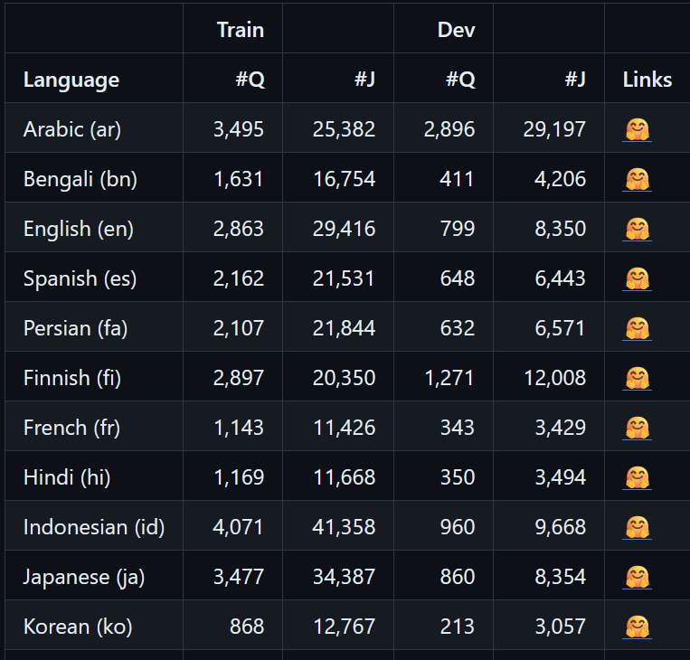
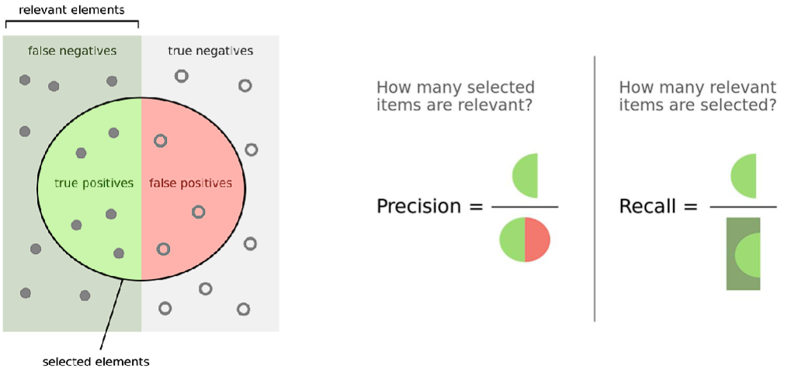
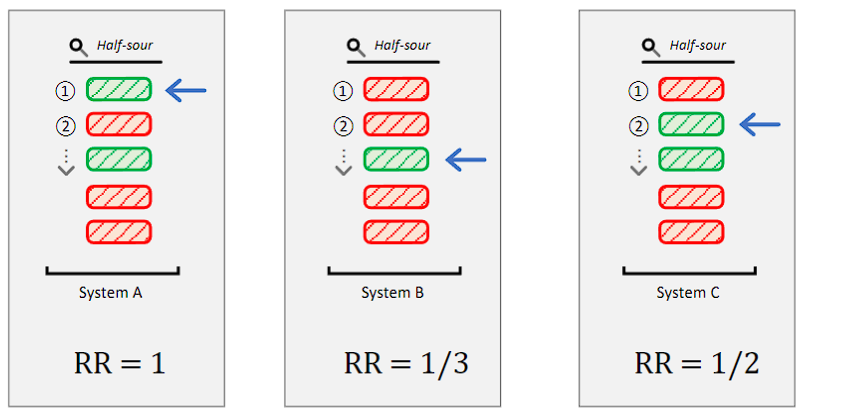
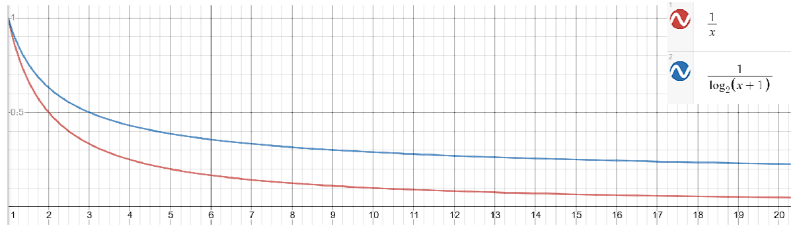
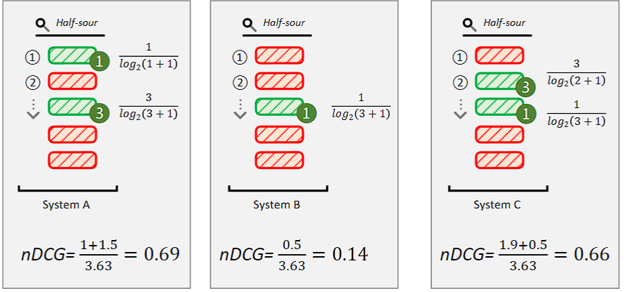

# *Fine Tuning* Model BERT untuk Representasi Teks yang Lebih Optimal dalam Masalah Pemeringakatan Teks

**Carles Octavianus (2006568613)**

---

## Masalah Pemeringkatan Teks

---
### Masalah pemeringkatan teks

Diberikan sebuah query $q$, dan sebuah koleksi teks yang berhingga $D = \{d_i\}_{i \in I}$, untuk suatu $k \in \mathbb{N}$, keluaran yang diharapkan adalah daftar terurut $D_k =[d_{i_1}, d_{i_2}, \dots, d_{i_k}]$ yang merupakan $k$ dokumen yang relevan ("terbaik") yang sesuai dengan query $q$. 

Untuk menilai $D_k$, digunakan metrik evaluasi seperti *precision*, *recall*, *mean reciprocal rank* (MRR), dan *normalized discounted cumulative gain* (NDCG).

---

Metrik-metrik ini digunakan untuk mengukur relevansi dari daftar yang dihasilkan, yang akan dijelaskan secara lebih rinci pada bagian selanjutnya. Permasalahan pemeringkatan teks sering juga disebut sebagai permasalahan *top-$k$ retrieval*, dengan $k$ adalah jumlah teks yang ingin diambil dari koleksi $D$.

---
## Evaluasi sistem pemeringkatan teks

---

### Bentuk Umum Dataset untuk Evaluasi
umumnya dataset evaluasi untuk masalah pemeringkatan teks terdiri dari 3 file berikut:
-  kumpulan teks dalam bentuk (teks_id, teks)
-  kumpulan query dalam bentuk (query_id, query)
-  kumpulan judgements yang telah dianotasi dalam bentuk (query_id, teks_id, nilai relevansi). Untuk pasangan $(q, d)$ yang tidak ada dalam judgements, diasumsikan memiliki nilai relevansi 0.

---

### Judgements
Untuk permasalahan pemeringkatan teks, pada umumnya dataset yang digunakan untuk evaluasi berbentuk $(q, d, r)$, di mana $r$ adalah penilaian relevansi (**judgements**) yang diberikan oleh manusia atau sistem. $r$ bisa berupa variabel biner yang menunjukkan apakah $d$ relevan dengan $q$ atau tidak, atau bisa juga berupa variabel numerik yang menunjukkan seberapa relevan pasangan $(q,d)$.

---

#### Sparse Judgements
Sparse judgements melibatkan penilaian yang minimal untuk setiap query. Biasanya, hanya ada ~1 dokumen yang dinilai relevan untuk setiap query. Dataset dengan sparse   jugdements biasanya memiliki ribuan query. Selain itu, judgements yang diberikan pada dataset ini berupa variabel biner. Contoh terkenal dari jenis ini adalah dataset MSMARCO Training & DEV.

---
#### Dense Judgements

Sebaliknya, dense judgements, melibatkan penilaian yang jauh lebih banyak untuk setiap query. Biasanya, ada lebih dari 10 dokumen yang dinilai relevan untuk satu query. pada dataset dengan Dense judgements biasanya jumlah query yang dianotasi lebih sedikit, biasanya 50 query atau lebih karena tentunya biaya menganotasi per query jauh lebih mahal. Koleksi TREC menggunakan penilaian yang padat untuk tujuan evaluasi mereka.

---
[masukin foto miracl]
<!-- {.center} -->
[masukin foto msmarco]

---

### Metriks Evaluasi

#### Precision & Recall

***Recall*** didefinisikan sebagai pecahan dari dokumen relevan (dalam koleksi teks $D$ secara keseluruhan) untuk kueri $q$ yang berhasil ditemukan dalam daftar terurut $D_k$. Secara matematis, rumusnya adalah:

$$
\begin{equation}
\text{Recall}(q, D_k)@k=\frac{\sum_{d \in D_k} \text{rel}(q, d)}{\sum_{d \in D} \text{rel}(q, d)}
\end{equation}
$$

dengan $\text{rel}(q, d) = 1$  jika $r>1$ (relevan) dengan $q$, dan 0 jika sebaliknya.

---

**Presisi** didefinisikan sebagai fraksi dokumen dalam daftar terurut $D_k$ yang relevan, yaitu:

$$
\begin{equation}
\text{Presisi}(D_k, q)@k =\frac{\sum_{ d \in D_k} \text{rel}(q, d)}{|D_k|}
\end{equation}

$$
---

---

#### MRR (*Mean Reciprocal Rank*)

- MRR berfokus pada dokumen pertama yang relevan dalam daftar terurut $D_k$.
- Berlaku untuk sparse judgements atau mengasumsikan pengguna puas dengan satu dokumen yang relevan.

$$
\text{MRR}(Q)@k = \frac{1}{|Q|} \sum_{q \in Q} \frac{1}{\text{FirstRank}(q)}
$$
- $Q$ adalah kumpulan query,
- $|Q|$ adalah jumlah query dalam $Q$, dan
- $\text{FirstRank}(q)$ adalah peringkat dokumen pertama yang relevan dalam daftar terurut $D_k$ untuk query $q$.

---

---

#### nDCG (*Normalized Discounted Cumulative Gain*)

nDCG adalah metrik yang umumnya digunakan untuk mengukur kualitas dari pencarian situs web. Tidak seperti metrik lain yang telah disebutkan sebelumnya, nDCG dirancang untuk penilaian relevansi $r$ dengan skala ordinal.Sebagai contoh, jika relevansi diukur dengan skala 5, maka $rel(q,d) \in \{1,2,3,4,5\}$. Misalkan *Discounted Cumulative Gain* (DCG) dapat didefinisikan sebagai berikut:

$$
\begin{equation}
\text{DCG}(D_k,q)@k = \sum_{d \in D_k, i \in \mathbb{N}} \frac{{rel(q,d)}}{\log_2(i+1)}    
\end{equation}
$$

atau 

$$
\begin{equation}
\text{DCG}(D_k,q)@k = \sum_{d \in D_k, i \in \mathbb{N}} \frac{2^{rel(q,d)}-1}{\log_2(i+1)}    
\end{equation}
$$

---
Dalam perhitungan ini, ada dua faktor yang digunakan: (1) tingkat relevansi (yaitu, teks yang sangat relevan memiliki nilai yang lebih tinggi dibandingkan dengan teks yang hanya relevan), dan (2) peringkat dimana hasil tersebut muncul (hasil yang relevan yang muncul di posisi atas dalam daftar terurut $D_k$ memiliki nilai yang lebih tinggi). Kata 'diskon' dalam DCG merujuk pada penurunan nilai gain saat dokumen muncul di posisi yang lebih rendah dalam daftar terurut, yang merupakan efek dari faktor (2). Selanjutnya, kita memperkenalkan metrik nDCG:

---
$$
\begin{equation}
\text{nDCG}(D_k,q) = \frac{\text{DCG}(D_k,q)}{\text{IDCG}(D_k,q)} \end{equation}
$$

Di mana IDCG adalah representasi ideal dari daftar yang telah diurutkan (*ground truth*): di mana dokumen diurutkan dari penilaian relevansi $r$ yang tertinggi hingga yang terendah. Dengan definisi ini, nDCG merepresentasikan DCG yang telah dinormalisasi dalam rentang [0,1] berdasarkan daftar terurut yang ideal.

---
- perbandingan nDCG dengan RR dengan binary relevance
- perhatikan bahwa nDCG men-*discount* lebih kecil dibandingkan MRR

---
- Misalkan diberikan dua dokumen dengan relevansi 1 dan 3, kita punya IDCG-nya.
- $$ \mathrm{IDCG}=\frac{3}{\log _2(1+1)}+\frac{1}{\log_2(2+1)}=3.63 $$
- 

---